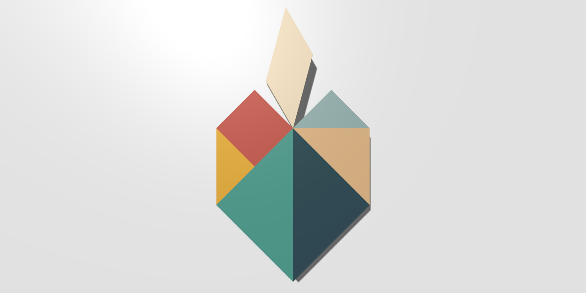

# Tangram

## Description
The tangram is a dissection puzzle consisting of seven flat shapes, called tans, which are put together to form shapes. The objective of the puzzle is to form a specific shape using all seven pieces, which can not overlap.

## How to Play
Click on empty area to show or hide floating tans.

Drag the tan to an empty place to land it.

To rotate the tan drag its corner.

Click the button at the bottom right to see an example.

To zoom, switch to view mode and drag up or down.

Tans automatically snap to the edges, their midpoints and corner points.

When all tans touch each other, a button appears to share with friends.

## Run
[Open on GitHub Pages](https://iliagrigorevdev.github.io/tangram/)

[Open on Google App Engine](https://tangram.appspot.com)

## Built With
[three.js](https://github.com/mrdoob/three.js), JavaScript 3D library.
